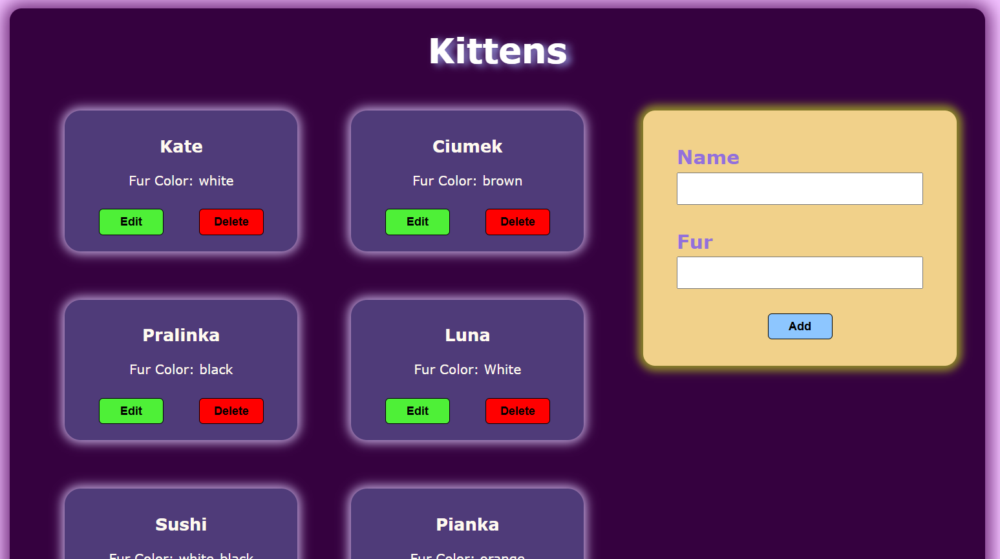
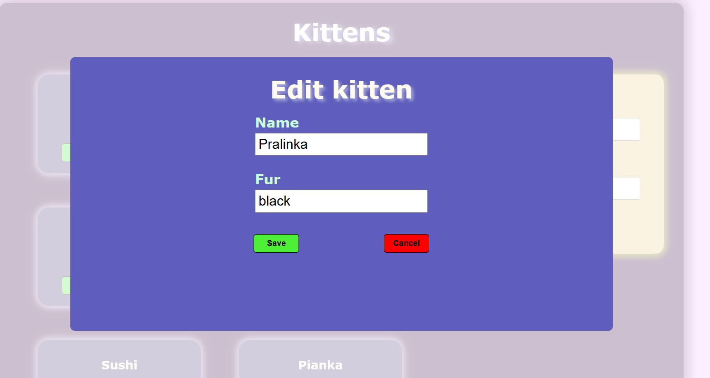

# 🐱 CatsWebApp – Cat CRUD Web App

CatRepo is a simple CRUD web application for managing cats. It allows you to add, edit, and delete cat entries. The project uses **C# (ASP.NET Core)** for the backend, **React** for the frontend, and stores data using **SQLite**.
## 🛠 Technologies
- **Backend:** C# / ASP.NET Core
- **Frontend:** React + Axios
- **Database:** SQLite

## ⚙️ Features
- View a list of all cats
- Add new cats
- Edit existing cats
- Delete cats


## 🚀 How to Run the Project

### Backend (C# / ASP.NET Core)
1. Open the project in **Visual Studio**.
2. Start the application.
3. The app will launch and automatically open **SwaggerUI** in browser at `https://localhost:7065/swagger/index.html`.

### Frontend (React)
1. Navigate to the `Cats.API/catrepo/catrepo` folder, where the React app is located.
2. Open terminal.
3. Install dependencies
    ```bash
   npm install
4. Start the application
      ```bash
   npm start
      


